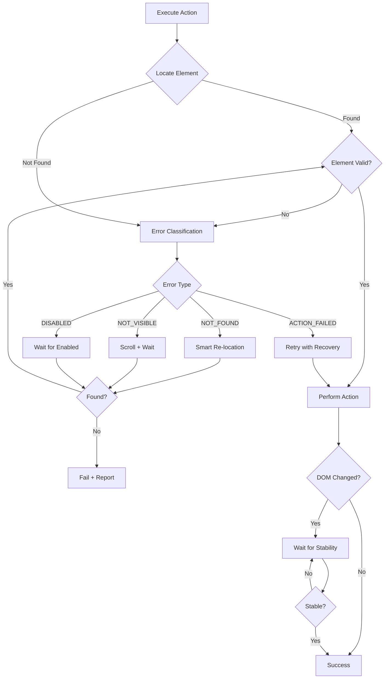

# HyperAgent Iteration 1: Element Locator Self-Healing + Intelligent Error Recovery

## Iteration Spec

**Headline:** v2.1.0 — "Self-healing locators with intelligent error recovery for 3x fewer action failures"

### Architect-Level Plan

This iteration focuses on the single highest-impact improvement vector: **Element Locator Self-Healing + Intelligent Error Recovery**. This directly addresses the most common failure mode in browser automation — element not found due to:

1. **Dynamic DOM changes** (React/Vue/Angular re-renders)
2. **Lazy-loaded content** (infinite scroll, lazy images)
3. **CSS class/structure changes** after page updates
4. **SPA navigation** without full page loads

### Key Improvements

#### 1. Smart Element Re-location (content.ts)
When an element is not found by index/CSS, automatically try:
- Text-based fuzzy matching (case-insensitive, partial match)
- ARIA label matching
- Role + visible text combination
- Similar element by position in DOM tree

#### 2. Scroll-Before-Locate Strategy (content.ts)
Before attempting to locate elements:
- Scroll through the page to trigger lazy loading
- Wait for elements to become visible
- Retry location after scroll

#### 3. Error Classification System (background.ts)
Classify failures into types:
- `ELEMENT_NOT_FOUND` — element doesn't exist
- `ELEMENT_NOT_VISIBLE` — element exists but hidden
- `ELEMENT_DISABLED` — element is disabled
- `ACTION_FAILED` — element found but action failed
- `TIMEOUT` — operation timed out
- `NAVIGATION_ERROR` — page navigation failed

Each error type gets specific recovery strategies.

#### 4. DOM State Waiting (content.ts)
After actions that trigger DOM changes:
- Wait for specific DOM mutations
- Poll for element appearance/disappearance
- Configurable wait conditions

### Files to Modify

1. **shared/types.ts** — Add error classification types
2. **shared/config.ts** — Add new configuration options
3. **entrypoints/content.ts** — Add self-healing locator + scroll strategies
4. **entrypoints/background.ts** — Add error classification + recovery strategies
5. **shared/llmClient.ts** — Update system prompt to leverage new capabilities

### Mermaid: Improved Action Execution Flow

### Implementation Order

1. Add error types to `types.ts`
2. Add config options to `config.ts`
3. Implement smart re-location in `content.ts`
4. Implement scroll-before-locate in `content.ts`
5. Add DOM state waiting in `content.ts`
6. Add error classification in `background.ts`
7. Update system prompt in `llmClient.ts`

### Success Metrics

- **Target:** Reduce "element not found" errors by 60%+
- **Target:** Improve successful task completion on complex SPAs by 40%+
- **Validation:** Test on e-commerce sites with infinite scroll, React apps, dynamic forms