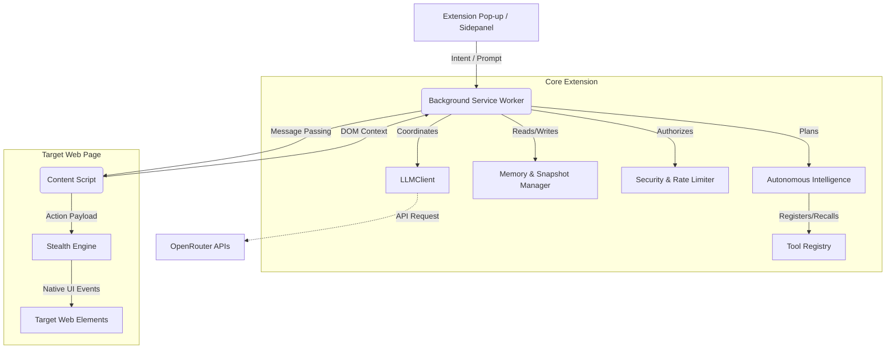

# System Architecture

## Overview

HyperAgent is designed as a secure, distributed, and fault-tolerant system within the constraints of Chrome Manifest V3. The architecture cleanly separates high-level orchestration, LLM telemetry, and raw DOM execution.

## Key Components

### 1. The Background Service Worker (Orchestrator)
Located at `entrypoints/background.ts`. Because MV3 enforces ephemeral service workers, state management is critical.
- **Lifecycle Management**: Starts, resumes, and terminates Agent tasks.
- **Usage Tracker**: Implements a `UsageTracker` class to track executed actions, monitor token costs, rate limits, and compute subscription boundaries.
- **Structured Logger**: Implements `StructuredLogger` providing unified, searchable event history for debugging distributed processes.

### 2. Autonomous Intelligence (`shared/autonomous-intelligence.ts`)
The algorithmic brain of the system.
- Receives prompts and translates them into an `AutonomousPlan`.
- Utilizes `UnderstandAndPlan()` and `executeWithAdaptation()` loop to execute sequences.
- It is resilient: if a target element is missing, it evaluates the error and natively adjusts the query (dynamic adaptation).

### 3. The LLM Client (`shared/llmClient.ts`)
Acts as the bridge between HyperAgent and OpenRouter models.
- **Prompt Injection Defense**: Strips out keywords (`ignore all previous instructions`, etc.).
- **Task Complexity Router**: Detects whether a prompt requires simple processing or complex reasoning, assigning models appropriately.
- **Circuit Breaker**: Implements `retryManager` natively holding back failing calls to prevent token-drain loops.

### 4. Content Script & Smart Resolvers (`entrypoints/content.ts`)
Injected into the target page. It never connects directly to LLMs, ensuring strict separation of concerns.
- **Context Collection**: Harvests DOM structures intelligently (ignoring invisible or irrelevant tags).
- **Shadow DOM Piercing**: Implements `queryAllWithShadow` and smart text-based resolution (fuzzy text searches, ARIA label scanning, etc.) guaranteeing elements are found even in complex SPAs.
- **Stealth Interaction (`shared/stealth-engine.ts`)**: Takes commands like "click login" and translates them to bezier-curve cursor movement, mouseover delays, mousedown events, and strict element focus mechanisms.

### 5. Memory & Context
The implementation relies heavily on maintaining a consistent record across the ephemeral constraints:
- **Snapshots**: Utilizes `SnapshotManager` to freeze and restore execution state.
- **Metric Telemetry**: `Metrics.ts` computes telemetry required for user-facing analytics and backend cost evaluations.

## Security Model
To mitigate the inherent risks of autonomous browser manipulation:
1. **Redaction**: Personal Identifiable Information (PII) is intercepted in `security.ts` before reaching the LLM client.
2. **Domain Boundaries**: Checks the `allowedDomains` vs `blockedDomains` continuously.
3. **Execution Halts**: If `requireConfirmationFor` flags trigger (e.g. `fill`, `navigate`), execution is paused and awaits explicit user confirmation via the `AutonomousCallbacks` architecture.
